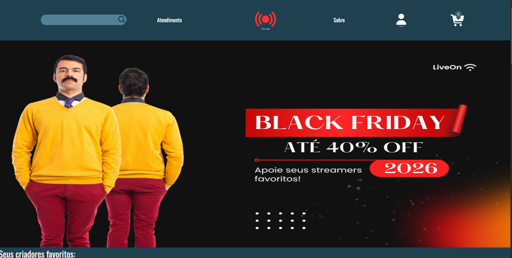

#  On Live

>Site feito predominantemente com display:grid
### Resumo
Mockup de e-commerce, o produto seria peças de roupa personalizadas de criadores de conteúdo. O nome da "empresa" é On_Live, o site possui 7 páginas sendo elas a página inicial, sobre a empresa, página de contato, carrinho, grade de produtos, página de cadastro e página de login

### Como acessar
Simplesmente clique no link da webpage no canto direito superior

### Ajustes e melhorias

O projeto foi voltado para o aprendizado da propriedade e de design, tendo assim alguns problemas:

- [x] Deformação dos elementos
- [x] Dificuldade no posicionamento dos elementos
- [x] Navegação confusa (ver rodapé para acessar todas as páginas)
- [x] Poluição Visual e falta de hierarquia  
